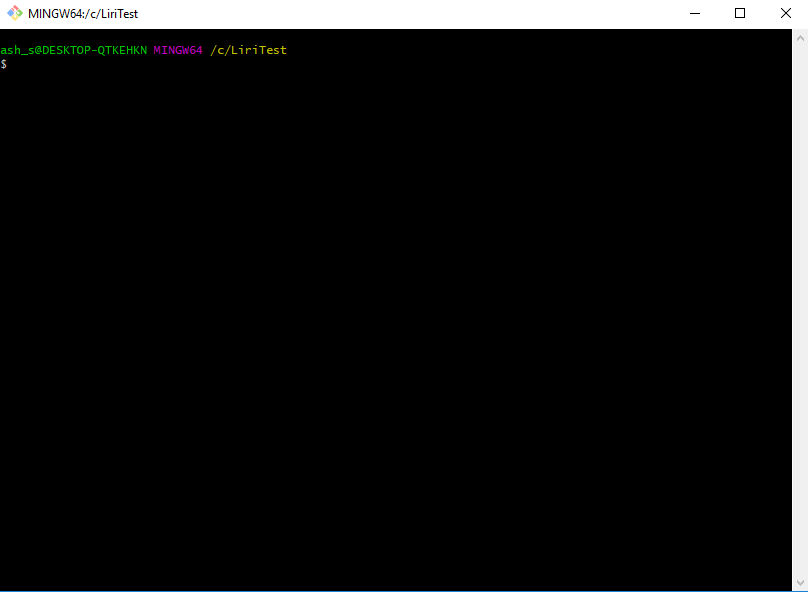

---

 Liri Bot
---

LIRI is like iPhone's SIRI. However, while SIRI is a Speech Interpretation and Recognition Interface, LIRI is a Language Interpretation and Recognition Interface. LIRI will be a command line node app that takes in parameters and gives you back data.

What can Liri do?

all you need to know:

LIRI will search Spotify for songs, Bands in Town for concerts, and OMDB for movies.

Make a new GitHub repository called liri-node-app and clone it to your computer.

To retrieve the data Liri will send requests using the axios package to the Bands in Town, Spotify and OMDB APIs. 

Liri also uses several packages:

Moment
DotEnv
axios

Please open up in node or terminal to run the code.

Here are example of my code in action:

